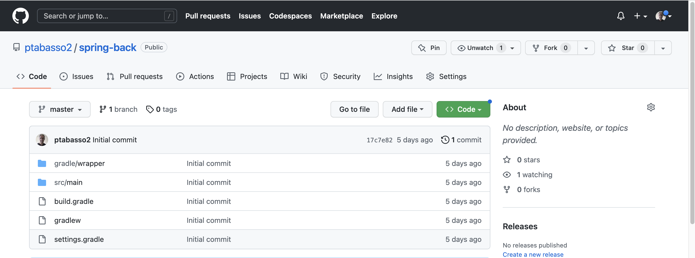
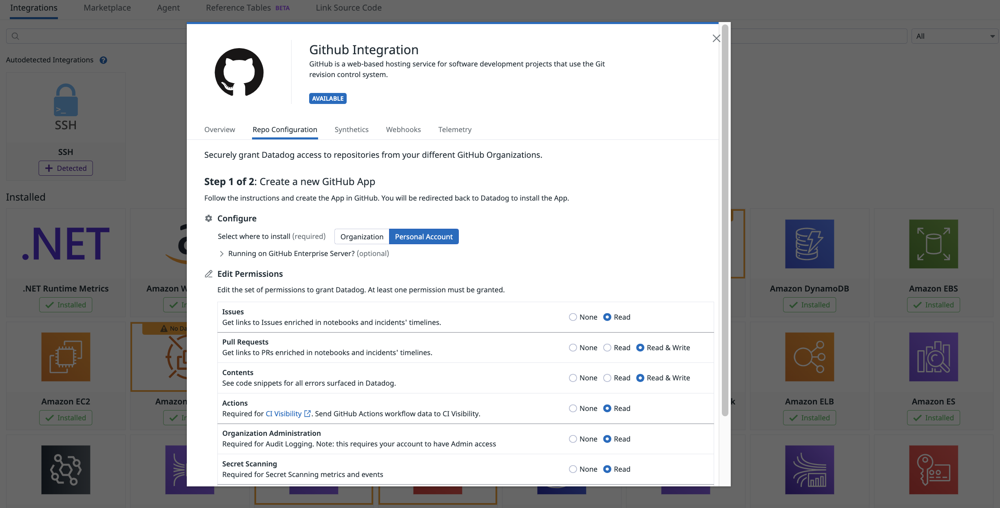
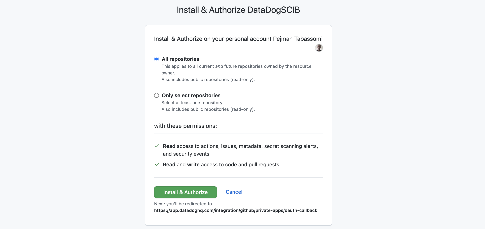

## Dynamic Instrumentation, Remote configuration and source code instrumentation hands-on lab

[](https://sonarcloud.io/dashboard?id=com.codenotfound%3Aspring-kafka-hello-world)

### Introduction
 
The sections of this tutorial are structured as follows

* Goal
* Pre-requisites
* Clone the repository
* Directory structure of the project
* Overview of the application
* Building the docker images (optional) 
* Run the application - before configuration phase
* Dynamic Instrumentation (DI), Remote configuration (RC) and Source code integration (SCI) set-up
* Run the application - after configuration phase
* Testing the application
* Configuring probes & results
* Conclusion

In each section, we'll describe the required steps to take in order to reach the goal.


### Goal of this lab

The purpose of this lab is to help familiarizing and practising the various steps required to set up and use the Dynamic Instrumentation feature.

<p align="left">
  
</p>

### Pre-requisites

+ About 90 minutes
+ Git client
+ A Datadog sandbox account with a valid API key
+ Your favorite text editor or IDE (Ex Sublime Text, Atom, vscode...)
+ Docker and Docker compose


### Clone the repository

<pre style="font-size: 12px">
COMP10619:~ pejman.tabassomi$ git clone https://github.com/ptabasso2/ese_dynamic_instrumentation
</pre>

### Directory structure of the project

The example below is the structure after having clone the project.

```shell
COMP10619:ese pejman.tabassomi$ tree
.
├── Dockerfiles
│   ├── Dockerfile.cassandra
│   ├── Dockerfile.springback
│   ├── Dockerfile.springfront
│   ├── cassandra.yaml
│   └── start.sh
├── README.md
├── dd-java-agent.jar
├── docker-compose.yml
├── img
├── springback
│   ├── build.gradle
│   ├── gradle
│   │   └── wrapper
│   │       ├── gradle-wrapper.jar
│   │       └── gradle-wrapper.properties
│   ├── gradlew
│   ├── logs
│   │   └── springback.log
│   ├── settings.gradle
│   └── src
│       └── main
│           ├── java
│           │   └── com
│           │       └── datadog
│           │           └── pej
│           │               └── back
│           │                   ├── BasicController.java
│           │                   ├── Quote.java
│           │                   ├── SpringBackApplication.java
│           │                   ├── Value.java
│           │                   ├── model
│           │                   │   └── Guide.java
│           │                   └── repository
│           │                       └── GuideRepository.java
│           └── resources
│               ├── application.properties
│               └── application.yml
└── springfront
    ├── build.gradle
    ├── gradle
    │   └── wrapper
    │       ├── gradle-wrapper.jar
    │       └── gradle-wrapper.properties
    ├── gradlew
    ├── settings.gradle
    └── src
        └── main
            ├── java
            │   └── com
            │       └── datadog
            │           └── pej
            │               └── front
            │                   ├── BasicController.java
            │                   ├── Quote.java
            │                   ├── SpringFrontApplication.java
            │                   └── Value.java
            └── resources
                └── application.yml

```

The main components of this project can be described as follows:
+ Two distinct microservices (`springfront` and `springback`) communicating with each other through Rest calls </br>
+ The various docker files needed to build the images and the docker-compose configuration to spin up the four containers (`dd-agent`, `springfront`, `springback` and `cassandra`).


### Building the docker images and run the application - before phase

**Building the images (Optional)**

For the sake of effectiveness, you will find the required images preloaded into the following registry https://hub.docker.com/repositories/pejese </br>
But if you ever need to change the Dockerfiles and rebuild the images you may consider the following steps:

First change the `image` key in the `docker-compose.yml` file to specify your repository/registry details.


````shell
[root@pt-instance-7:~/rest]$ docker-compose build springfront
Building springfront
Sending build context to Docker daemon  113.8MB
Step 1/9 : FROM adoptopenjdk/openjdk11:ubuntu-nightly-slim
 ---> 86b175442692
Step 2/9 : ENV PS1A="[\[\e[1m\]\[\e[38;5;46m\]\u\[\e[0m\]@\h:\[\e[1m\]\[\e[38;5;21m\]\w\[\e[0m\]]$ "
 ---> Using cache
 ---> 9dcefd8d3438
Step 3/9 : ENV TZ="Europe/Paris"
 ---> Using cache
 ---> bcb97c6f5f66
Step 4/9 : RUN ln -snf /usr/share/zoneinfo/$TZ /etc/localtime && echo $TZ > /etc/timezone
 ---> Using cache
 ---> a8b6630325b4
Step 5/9 : RUN apt update  && apt -y install net-tools iputils-ping curl vim procps netcat wget gnupg2 apt-transport-https sudo lsof unzip git  && echo "alias ll='ls -lrt'" >> /root/.bashrc && echo 'PS1=$PS1A' >> ~/.bashrc && echo 'HISTFILESIZE=20000' >> ~/.bashrc && echo 'HISTSIZE=10000' >> ~/.bashrc
 ---> Using cache
 ---> 64764127c101
Step 6/9 : WORKDIR /app
 ---> Using cache
 ---> c4eba2e16573
Step 7/9 : COPY springfront/build/libs/spring-front.jar spring-front.jar
 ---> a7b7bbf726ed
Step 8/9 : EXPOSE 8080
 ---> Running in a2f715871d26
Removing intermediate container a2f715871d26
 ---> 3a3356283968
Step 9/9 : CMD java -jar spring-front.jar
 ---> Running in ba034aba438f
Removing intermediate container ba034aba438f
 ---> 6da31b8131d0
Successfully built 6da31b8131d0
Successfully tagged sbf0:latest
````

And then pushing it to the image registry (`docker push`). Make sure you are authenticated to your registry:

````shell
[root@pt-instance-7:~/rest]$ docker login -u=pejese -p=xxxxxxxxxxx
WARNING! Using --password via the CLI is insecure. Use --password-stdin.
WARNING! Your password will be stored unencrypted in /root/.docker/config.json.
Configure a credential helper to remove this warning. See
https://docs.docker.com/engine/reference/commandline/login/#credentials-store

Login Succeeded
````

And then

````shell
[root@pt-instance-7:~/rest]$ docker push pejese/springfront:v0
````

Another way of building the images is shown below and relies on docker commands instead of the docker-compose ones:

````shell
[root@pt-instance-7:~/rest]$ docker build -f Dockerfiles/Dockerfile.cassandra -t pejese/cassandra:v0 .
...
[root@pt-instance-7:~/rest]$ docker login -u=pejese -p=xxxxxxxxxxx
...
[root@pt-instance-7:~/rest]$ docker push pejese/springfront:v0
...
[root@pt-instance-7:~/rest]$ docker run -it -p9042:9042/tcp -p9160:9160/tcp -p7199:7199/tcp -v /root/rest/Dockerfiles/cassandra.yaml:/opt/cassandra/conf/cassandra.yaml -d --name cass -h cassandra pejese/cassandra:v0
````

***Note***: For the cassandra image, you would need two additional files (`cassandra.yaml` and `start.sh`) which are respectively specifying the configuration details for the instance and preloading dummy data when running the image for the first time. 


**Running <a name="runapp">the</a> application**

Simply run this command:

````shell
[root@pt-instance-7:~/rest]$ docker-compose up -d
Creating network "app" with driver "bridge"
Creating dd-agent-dogfood-jmx-di ... done
Creating cass                    ... done
Creating springback              ... done
Creating springfront             ... done
````

Checking status

````shell
[root@pt-instance-7:~/rest]$ docker-compose ps
         Name                        Command                  State                                                                Ports                                                          
--------------------------------------------------------------------------------------------------------------------------------------------------------------------------------------------------
cass                      docker-entrypoint.sh ./sta ...   Up             7000/tcp, 7001/tcp, 0.0.0.0:7199->7199/tcp,:::7199->7199/tcp, 0.0.0.0:9042->9042/tcp,:::9042->9042/tcp,                 
                                                                          0.0.0.0:9160->9160/tcp,:::9160->9160/tcp                                                                                
dd-agent-dogfood-jmx-di   /bin/entrypoint.sh               Up (healthy)   0.0.0.0:8125->8125/tcp,:::8125->8125/tcp, 8125/udp, 0.0.0.0:8126->8126/tcp,:::8126->8126/tcp                            
springback                /bin/sh -c java -jar sprin ...   Exit 1                                                                                                                                 
springfront               /bin/sh -c java -jar sprin ...   Up             0.0.0.0:8080->8080/tcp,:::8080->8080/tcp                
````


At this point you may see that springback exited. This is expected behavior as the cassandra database container wasn't ready yet by the time springback started.
Starting springback one more time will just work fine by sending some requests to the 8080 port on the same host (`localhost`) 


````shell
[root@pt-instance-7:~/rest]$ curl localhost:8080/base/un/deux/trois
Quote{type='success', value=Value{id=9, quote='Alea jacta est'}}

````

Now as all the components are up and running, and every pieces work well together. It's time to move on to the next step and set up dynamic instrumentation.


### Dynamic Instrumentation (DI), Remote configuration (RC) and Source code integration (SCI) set-up

**Enabling Dynamic Instrumentation**

Details can be found below:
[Enable Dynamic Instrumentation](https://docs.datadoghq.com/dynamic_instrumentation/enabling/java/?tab=commandarguments#installation)

In summary you would to proceed as follows:

_On the DD Agent side_
1. Having the latest version of the DD Agent (7.39.1+)
2. Having APM enabled (trace agent up and running and listening on port 8126)
3. Having `Remote config` enabled (see further details in the following section)

_On the tracing library side (java agent)_
1. Download the `dd-java-agent.jar`
2. Dynamic Instrumentation enabled by setting `-Ddd.dynamic.instrumentation.enabled` flag or `DD_DYNAMIC_INSTRUMENTATION_ENABLED` environment variable to `true`. Specify `dd.service`, `dd.env`, and `dd.version` Unified Service Tags so you can filter and group your probes and target active clients across these dimensions
3. Enabling remote config also at the java agent level by setting the `-Ddd.remote_config.enabled` flag set to true or `DD_REMOTE_CONFIG_ENABLED` environment variable to `true`. (Cf further details in the following section)


**Enabling Remote Config**
In the previous section we surfaced the remote config details. Remote config is actually a feature that is common to several other functionalities than Dynamic Instrumentation. It is used alongside DI as probes set up are managed through the UI (This will be covered in the the next sections).

Enabling remote config consists of 3 parts
1. In the UI first (https://app.datadoghq.com/organization-settings/remote-config) where a `remote config key` needs to be generated
2. At the DD Agent level by enabling two env variables (the key being generated in the UI)
```
DD_REMOTE_CONFIGURATION_ENABLED=true
DD_REMOTE_CONFIGURATION_KEY=DDRCM_QORW64THZYAAGQKLUJSGHLDVOMYS44DSN5SC4ZDPM6RWWZLZ3EUDKZRYGQ4DSN5SC4ZDPM6RWWZLZ3EUDKNJSMVSDAMRTGNTDKNDCGA4DOMRYHA2A
```
3. At the tracing library level by setting the `-Ddd.remote_config.enabled` flag set to true or `DD_REMOTE_CONFIG_ENABLED` environment variable to `true`

When remote config is enabled in the UI, you should see something along the lines of

<p align="left">
  
</p>


**Enabling Source code integration**

The two first sections are the bare minimum required to be able to use the DI feature. 
And we are now ready to configure probes and review in details how they can be used.

But before that we will also enable `Source Code Integration` that will facilitate much more probe configuration details. The purpose of SCI is to link a project repository (ex GitHub) and allow access to the source code details to configure probes in the DI section of the UI.

SCI relies on the DD GitHub Integration

For further details
[Enable Source Code Integration](https://docs.datadoghq.com/integrations/guide/source-code-integration/?tab=dockerruntime#links-to-git)


1. Push the two microservices code to your github account (`springfront` & `springback`). You should have two distinct repos, see example below for one of the projects. 
<p align="left">
  
</p>

2. Once done, save both the git `commit.sha` and `repository_url` for the two projetcs above.
You should have something equivalent to

`git.commit.sha:17c7e82807d1ca54ff5aaf032a5aca2b52beab3f`and `git.repository_url:github.com/ptabasso2/spring-back` at hand for the `springback` project.

3. Start the services and run some traffic (See above [Above](#runapp))

4. Go to https://app.datadoghq.com/source-code/setup/apm and you will guided through the configuration of the GitHub Integration.
After a short while, in step 1 at the top of the in-app instructions, pick the `springfront` service 

There will be four parts in this process
* Creating the GitHub App

<p align="left">
  
</p>

* Installing and configuring the GitHub App

<p align="left">
  
</p>

* Manage permissions for the GitHUb App

<p align="left">
  
</p>

Once you are done with that part, the last remaining bit is the tracing library configuration to get it working. This is also described in the docs 
[Source Code Integration - Configuration](https://docs.datadoghq.com/integrations/guide/source-code-integration/?tab=dockerruntime#configuration)

But in a nutshell, the two properties above (`git.commit.sha`and `git.repository_url`) are required by the tracing libraries and should be set as tags.

A syntax example you might want to consider when using the Java agent is the following. Environment variables can be used instead.

````java
-Ddd.tags=git.commit.sha:9383abbd845cec77c4c65873f6d981bc51d1ead7,git.repository_url:github.com/ptabasso2/spring-front
````

**Summary of the configuration steps**

In order to enable these three features, you will need to update the `docker-compose.yml` file and use the Datadog UI to
+ Enable remote config in the UI: https://app.datadoghq.com/organization-settings/remote-config
+ Change the DD Agent configuration by adding these two env variables to enable Remote config
```
DD_REMOTE_CONFIGURATION_ENABLED=true
DD_REMOTE_CONFIGURATION_KEY=DDRCM_QORW64THZYAAGQKLUJSGHLDVOMYS44DSN5SC4ZDPM6RWWZLZ3EUDKZRYGQ4DSN5SC4ZDPM6RWWZLZ3EUDKNJSMVSDAMRTGNTDKNDCGA4DOMRYHA2A
```
+ Enable both dynamic instrumentation and remote config at the tracing level (`-Ddd.dynamic.instrumentation.enabled=true`, `-Ddd.remote_config.enabled=true` or by using the corresponding env variables form)
+ Create and install a GitHub app (https://app.datadoghq.com/source-code/setup/apm) to link with source code
+ Manage permissions of the GitHub app
+ Use the commit hash and github url as tags for the tracing library


### Run the application - after configuration phase

### Testing the application and generating load

### Configuring probes & results
https://docs.datadoghq.com/dynamic_instrumentation/?tab=configurationyaml#explore-dynamic-instrumentation

### Conclusion
