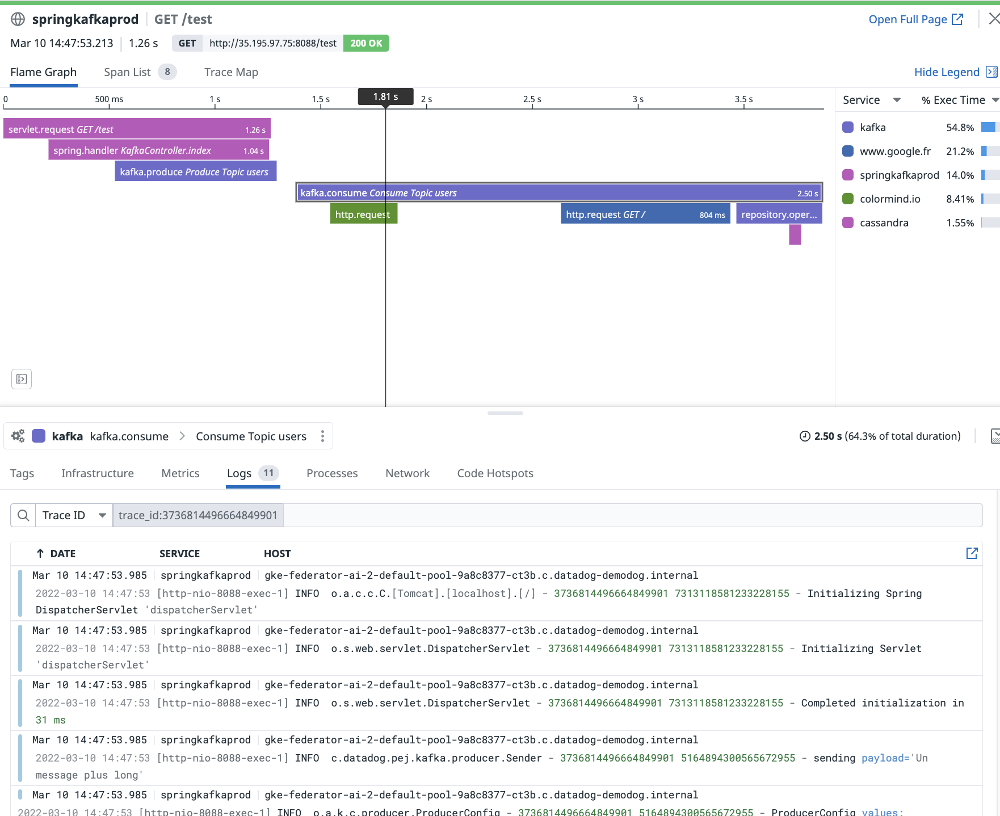

# Tutorial APM Java SpringBoot, Kafka, Cassandra on k8s

[](https://sonarcloud.io/dashboard?id=com.codenotfound%3Aspring-kafka-hello-world)


A detailed step-by-step tutorial on how to implement an Apache Kafka Consumer and Producer, a cassandra DB using Spring Kafka and Spring Boot in a kubernetes infrastructure (GKE)
<br>In this tutorial we will also enable distributed tracing using the Datadog java agent (automatic instrumentation).
This tutorial assumes that 
+ You already have access to a kubernetes cluster. The example below has been tested on GKE. But you can replicate the same instructions on any type of clusters managed or not.
+ The Kubernetes Datadog cluster agent deployed (Either through a Daemonset or Helm). Note that there those steps are also described below
  

### _Preliminary tasks_


**Deploy the Datadog Agent and the cluster Agent**

```
COMP10619:pejman.tabassomi$ helm install ddagent -f datadog/helm/values.yaml --set datadog.apiKey=687xxxxxxxxxxxxxxxxxxxxx3c2 datadog/datadog --set targetSystem=linux
NAME: ddagent
LAST DEPLOYED: Thu Mar 10 14:43:48 2022
NAMESPACE: default
STATUS: deployed
REVISION: 1
TEST SUITE: None
NOTES:
Datadog agents are spinning up on each node in your cluster. After a few
minutes, you should see your agents starting in your event stream:
    https://app.datadoghq.com/event/stream

The Datadog Agent is listening on port 8126 for APM service.

#################################################################
####               WARNING: Deprecation notice               ####
#################################################################

The option `datadog.apm.enabled` is deprecated, please use `datadog.apm.portEnabled` to enable TCP communication to the trace-agent.
The option `datadog.apm.socketEnabled` is enabled by default and can be used to rely on unix socket or name-pipe communication.
```

**Checking the deployment**


Running the following will display the set of manifest files that will be used to create the application on the cluster.

```
COMP10619:pejman.tabassomi$ helm ls
NAME   	NAMESPACE	REVISION	UPDATED                             	STATUS  	CHART         	APP VERSION
ddagent	default  	1       	2022-03-10 14:43:48.707422 +0100 CET	deployed	datadog-2.30.5	7    

COMP10619:helm pejman.tabassomi$ kubectl get svc
NAME                            TYPE        CLUSTER-IP     EXTERNAL-IP   PORT(S)    AGE
ddagent-datadog-cluster-agent   ClusterIP   10.116.1.167   <none>        5005/TCP   34s
ddagent-kube-state-metrics      ClusterIP   10.116.3.82    <none>        8080/TCP   34s
kubernetes                      ClusterIP   10.116.0.1     <none>        443/TCP    48d

COMP10619:helm pejman.tabassomi$ kubectl get pods
NAME                                             READY   STATUS    RESTARTS   AGE
ddagent-datadog-4wf2l                            4/4     Running   0          38s
ddagent-datadog-cluster-agent-59986f5958-m9xft   1/1     Running   0          38s
ddagent-datadog-clusterchecks-7c8dcb4dd9-5pqgd   0/1     Running   0          37s
ddagent-datadog-clusterchecks-7c8dcb4dd9-sttgr   1/1     Running   0          37s
ddagent-datadog-m9bxd                            3/4     Running   0          38s
ddagent-datadog-xkkfg                            3/4     Running   0          38s
ddagent-kube-state-metrics-787986db96-cz7xp      1/1     Running   0          38s

```

**Deploying the application**


1. Deploying the required k8s services

```
COMP10619:k8s pejman.tabassomi$ kubectl apply -f svc.yaml 
service/kafka created
service/springkafkaprod created
service/zookeeper created
service/cassandra created
```

```
COMP10619:k8s pejman.tabassomi$ kubectl get svc
NAME                            TYPE           CLUSTER-IP     EXTERNAL-IP   PORT(S)                      AGE
cassandra                       ClusterIP      10.116.0.16    <none>        9042/TCP                     38s
ddagent-datadog-cluster-agent   ClusterIP      10.116.1.167   <none>        5005/TCP                     2m24s
ddagent-kube-state-metrics      ClusterIP      10.116.3.82    <none>        8080/TCP                     2m24s
kafka                           ClusterIP      10.116.6.71    <none>        9092/TCP                     38s
kubernetes                      ClusterIP      10.116.0.1     <none>        443/TCP                      48d
springkafkaprod                 LoadBalancer   10.116.10.3    34.89.190.246 8088:32496/TCP               38s
zookeeper                       ClusterIP      10.116.10.34   <none>        2181/TCP,2888/TCP,3888/TCP   38s
```

2. Deploying k8s deployments


```
COMP10619:k8s pejman.tabassomi$ kubectl apply -f depl.yaml 
deployment.apps/zookeeper created
deployment.apps/kafka created
deployment.apps/springkafkacons created
deployment.apps/springkafkaprod created
deployment.apps/cassandra created
```


As we can see, *zookeeper*, *kafka*, *springkafka* and *cassandra* are up and running.
<br>The next list shows up the running pods and we can see that the three components (zookeeper, kafka and spring) are also running. 
 
```
COMP10619:k8s pejman.tabassomi$ kubectl get pods
NAME                                             READY   STATUS    RESTARTS   AGE
cassandra-8467974db7-ddftd                       1/1     Running   0          22s
ddagent-datadog-4wf2l                            4/4     Running   0          2m15s
ddagent-datadog-cluster-agent-59986f5958-m9xft   1/1     Running   0          2m15s
ddagent-datadog-clusterchecks-7c8dcb4dd9-5pqgd   1/1     Running   0          2m14s
ddagent-datadog-clusterchecks-7c8dcb4dd9-sttgr   1/1     Running   0          2m14s
ddagent-datadog-m9bxd                            4/4     Running   0          2m15s
ddagent-datadog-xkkfg                            4/4     Running   0          2m15s
ddagent-kube-state-metrics-787986db96-cz7xp      1/1     Running   0          2m15s
kafka-7b6df4c7cd-nf227                           1/1     Running   0          22s
springkafkacons-5846bbdcc-trcg7                  1/1     Running   0          22s
springkafkaprod-574b8f7c68-qccr4                 1/1     Running   0          22s
zookeeper-748c5db78d-88xpg                       1/1     Running   0          22s
```


### _Checking connectivity from the internet to the front loadbalancer (springkafka service)_

That applies if you run the application on a managed platform (ex EKS, AKS GKE).
On GKE for instance, one would need to whitelist the IP address range that is allowed to access the LB.
<br>By default no connection is allowed. Changing the Firewall settings might be necessary.
Once done, we can test the application.

### _Run the tests_

Open a new terminal window and run the following curl command **multiple times**:

```
COMP10619:Kafka pejman.tabassomi$ curl 34.89.190.246:8088/test
test
```

In this example this is the external IP of the loadbalancer (springkafkaprod) that is being used.


### _Results_

<p align="center">
  
</p>


