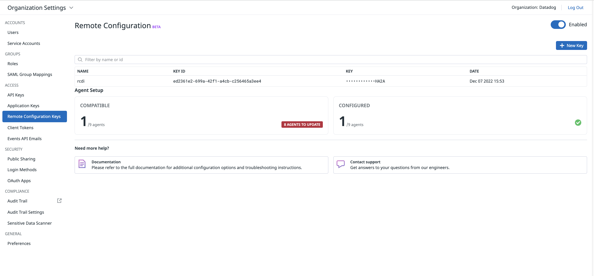

## Dynamic Instrumentation, Remote configuration and source code instrumentation hands-on lab

[](https://sonarcloud.io/dashboard?id=com.codenotfound%3Aspring-kafka-hello-world)

### Introduction
 
The sections of this tutorial are structured as follows

* Goal
* Pre-requisites
* Clone the repository
* Directory structure of the project
* Overview of the application
* Building the docker images and run the application - before phase
* Dynamic Instrumentation (DI), Remote configuration (RC) and Source code integration (SCI) set-up
* Building the docker images and run the application - after phase
* Starting and running the application
* Configuring probes & results
* Conclusion

In each section, we'll describe the required steps to take in order to reach the goal.


### Goal of this lab

The purpose of this lab is to help familiarizing and practising the various steps required to set up and use the Dynamic Instrumentation feature.

<p align="left">
  
</p>

### Pre-requisites

+ About 90 minutes
+ Git client
+ A Datadog sandbox account with a valid API key
+ Your favorite text editor or IDE (Ex Sublime Text, Atom, vscode...)
+ Docker and Docker compose


### Clone the repository

<pre style="font-size: 12px">
COMP10619:~ pejman.tabassomi$ git clone https://github.com/ptabasso2/ese_dynamic_instrumentation
</pre>

### Directory structure of the project

The example below is the structure after having clone the project.

```shell
COMP10619:ese pejman.tabassomi$ tree
.
├── Dockerfiles
│   ├── Dockerfile.cassandra
│   ├── Dockerfile.springback
│   ├── Dockerfile.springfront
│   ├── cassandra.yaml
│   └── start.sh
├── README.md
├── dd-java-agent.jar
├── docker-compose.yml
├── img
├── springback
│   ├── build.gradle
│   ├── gradle
│   │   └── wrapper
│   │       ├── gradle-wrapper.jar
│   │       └── gradle-wrapper.properties
│   ├── gradlew
│   ├── logs
│   │   └── springback.log
│   ├── settings.gradle
│   └── src
│       └── main
│           ├── java
│           │   └── com
│           │       └── datadog
│           │           └── pej
│           │               └── back
│           │                   ├── BasicController.java
│           │                   ├── Quote.java
│           │                   ├── SpringBackApplication.java
│           │                   ├── Value.java
│           │                   ├── model
│           │                   │   └── Guide.java
│           │                   └── repository
│           │                       └── GuideRepository.java
│           └── resources
│               ├── application.properties
│               └── application.yml
└── springfront
    ├── build.gradle
    ├── gradle
    │   └── wrapper
    │       ├── gradle-wrapper.jar
    │       └── gradle-wrapper.properties
    ├── gradlew
    ├── settings.gradle
    └── src
        └── main
            ├── java
            │   └── com
            │       └── datadog
            │           └── pej
            │               └── front
            │                   ├── BasicController.java
            │                   ├── Quote.java
            │                   ├── SpringFrontApplication.java
            │                   └── Value.java
            └── resources
                └── application.yml

```

The main components of this project can be described as follows:
+ Two distinct microservices (`springfront` and `springback`) communicating with each other through Rest calls </br>
+ The various docker files needed to build the images and the docker-compose configuration to spin up the four containers (`dd-agent`, `springfront`, `springback` and `cassandra`).


### Building the docker images and run the application - before phase

**Building the images (Optional)**

For the sake of effectiveness, you will find the required images preloaded into the following registry https://hub.docker.com/repositories/pejese </br>
But if you ever need to change the Dockerfiles and rebuild the images you may consider the following steps:

First change the `image` key in the `docker-compose.yml` file to specify your repository/registry details.


````shell
[root@pt-instance-7:~/rest]$ docker-compose build springfront
Building springfront
Sending build context to Docker daemon  113.8MB
Step 1/9 : FROM adoptopenjdk/openjdk11:ubuntu-nightly-slim
 ---> 86b175442692
Step 2/9 : ENV PS1A="[\[\e[1m\]\[\e[38;5;46m\]\u\[\e[0m\]@\h:\[\e[1m\]\[\e[38;5;21m\]\w\[\e[0m\]]$ "
 ---> Using cache
 ---> 9dcefd8d3438
Step 3/9 : ENV TZ="Europe/Paris"
 ---> Using cache
 ---> bcb97c6f5f66
Step 4/9 : RUN ln -snf /usr/share/zoneinfo/$TZ /etc/localtime && echo $TZ > /etc/timezone
 ---> Using cache
 ---> a8b6630325b4
Step 5/9 : RUN apt update  && apt -y install net-tools iputils-ping curl vim procps netcat wget gnupg2 apt-transport-https sudo lsof unzip git  && echo "alias ll='ls -lrt'" >> /root/.bashrc && echo 'PS1=$PS1A' >> ~/.bashrc && echo 'HISTFILESIZE=20000' >> ~/.bashrc && echo 'HISTSIZE=10000' >> ~/.bashrc
 ---> Using cache
 ---> 64764127c101
Step 6/9 : WORKDIR /app
 ---> Using cache
 ---> c4eba2e16573
Step 7/9 : COPY springfront/build/libs/spring-front.jar spring-front.jar
 ---> a7b7bbf726ed
Step 8/9 : EXPOSE 8080
 ---> Running in a2f715871d26
Removing intermediate container a2f715871d26
 ---> 3a3356283968
Step 9/9 : CMD java -jar spring-front.jar
 ---> Running in ba034aba438f
Removing intermediate container ba034aba438f
 ---> 6da31b8131d0
Successfully built 6da31b8131d0
Successfully tagged sbf0:latest
````

And then pushing it to the image registry (`docker push`). Make sure you are authenticated to your registry:

````shell
[root@pt-instance-7:~/rest]$ docker login -u=pejese -p=xxxxxxxxxxx
WARNING! Using --password via the CLI is insecure. Use --password-stdin.
WARNING! Your password will be stored unencrypted in /root/.docker/config.json.
Configure a credential helper to remove this warning. See
https://docs.docker.com/engine/reference/commandline/login/#credentials-store

Login Succeeded
````

And then

````shell
[root@pt-instance-7:~/rest]$ docker push pejese/springfront:v0
````

Another way of building the images is shown below and relies on docker commands instead of the docker-compose ones:

````shell
[root@pt-instance-7:~/rest]$ docker build -f Dockerfiles/Dockerfile.cassandra -t pejese/cassandra:v0 .
...
[root@pt-instance-7:~/rest]$ docker login -u=pejese -p=xxxxxxxxxxx
...
[root@pt-instance-7:~/rest]$ docker push pejese/springfront:v0
...
[root@pt-instance-7:~/rest]$ docker run -it -p9042:9042/tcp -p9160:9160/tcp -p7199:7199/tcp -v /root/rest/Dockerfiles/cassandra.yaml:/opt/cassandra/conf/cassandra.yaml -d --name cass -h cassandra pejese/cassandra:v0
````

***Note***: For the cassandra image, you would need two additional files (`cassandra.yaml` and `start.sh`) which are respectively specifying the configuration details for the instance and preloading dummy data when running the image for the first time. 


**Running the application**

Simply run this command:

````shell
[root@pt-instance-7:~/rest]$ docker-compose up -d
Creating network "app" with driver "bridge"
Creating dd-agent-dogfood-jmx-di ... done
Creating cass                    ... done
Creating springback              ... done
Creating springfront             ... done
````

Checking status

````shell
[root@pt-instance-7:~/rest]$ docker-compose ps
         Name                        Command                  State                                                                Ports                                                          
--------------------------------------------------------------------------------------------------------------------------------------------------------------------------------------------------
cass                      docker-entrypoint.sh ./sta ...   Up             7000/tcp, 7001/tcp, 0.0.0.0:7199->7199/tcp,:::7199->7199/tcp, 0.0.0.0:9042->9042/tcp,:::9042->9042/tcp,                 
                                                                          0.0.0.0:9160->9160/tcp,:::9160->9160/tcp                                                                                
dd-agent-dogfood-jmx-di   /bin/entrypoint.sh               Up (healthy)   0.0.0.0:8125->8125/tcp,:::8125->8125/tcp, 8125/udp, 0.0.0.0:8126->8126/tcp,:::8126->8126/tcp                            
springback                /bin/sh -c java -jar sprin ...   Exit 1                                                                                                                                 
springfront               /bin/sh -c java -jar sprin ...   Up             0.0.0.0:8080->8080/tcp,:::8080->8080/tcp                
````


At this point you may see that springback exited. This is expected behavior as the cassandra database container wasn't ready yet by the time springback started.
Starting springback one more time will just work fine by sending some requests to the 8080 port on the same host (`localhost`) 


````shell
[root@pt-instance-7:~/rest]$ curl localhost:8080/base/un/deux/trois
Quote{type='success', value=Value{id=9, quote='Alea jacta est'}}

````

Now as all the components are up and running, and every pieces work well together. It's time to move on to the next step and set up dynamic instrumentation.


### Dynamic Instrumentation (DI), Remote configuration (RC) and Source code integration (SCI) set-up

**Enabling Dynamic Instrumentation**

Details can be found below:
[Enable Dynamic Instrumentation]([https://www.google.com](https://docs.datadoghq.com/dynamic_instrumentation/enabling/java/?tab=commandarguments#installation)

In summary you would to proceed as follows:

_On the DD Agent side_
1. Having the latest version of the DD Agent (7.39.1+)
2. Having APM enabled (trace agent up and running and listening on port 8126)
3. Having `Remote config` enabled (see further details in the following section)

_On the tracing library side (java agent)_
1. Download the `dd-java-agent.jar`
2. Dynamic Instrumentation enabled by setting `-Ddd.dynamic.instrumentation.enabled` flag or `DD_DYNAMIC_INSTRUMENTATION_ENABLED` environment variable to `true`. Specify `dd.service`, `dd.env`, and `dd.version` Unified Service Tags so you can filter and group your probes and target active clients across these dimensions
3. Enabling remote config also at the java agent level by setting the `-Ddd.remote_config.enabled` flag set to true or `DD_REMOTE_CONFIG_ENABLED` environment variable to `true`. (Cf further details in the following section)


**Enabling Remote Config**
In the previous section we surfaced the remote config details. Remote config is actually a feature that is common to several other functionalities than Dynamic Instrumentation. It is used alongside DI as probes set up are managed through the UI (This will be covered in the the next sections).

Enabling remote config consists of 3 parts
1. In the UI first (https://app.datadoghq.com/organization-settings/remote-config) where a `remote config key` needs to be generated
2. At the DD Agent level by enabling two env variables (the key being generated in the UI) 
```
DD_REMOTE_CONFIGURATION_ENABLED=true
DD_REMOTE_CONFIGURATION_KEY=DDRCM_QORW64THZYAAGQKLUJSGHLDVOMYS44DSN5SC4ZDPM6RWWZLZ3EUDKZRYGQ4DSN5SC4ZDPM6RWWZLZ3EUDKNJSMVSDAMRTGNTDKNDCGA4DOMRYHA2A
```
3. At the tracing library level by setting the `-Ddd.remote_config.enabled` flag set to true or `DD_REMOTE_CONFIG_ENABLED` environment variable to `true`

When remote config is enabled in the UI, you should see something along the lines of

<p align="left">
  
</p>


### Building the docker images and run the application - after phase


**Retrieving the parent span context and creating a child span**

````java
/* Retrieving the context of the parent span after */
SpanContext parentSpan = tracer.extract(Format.Builtin.TEXT_MAP, new TextMapAdapter(mapextract));

/* Building the child span and nesting it under the parentspan */
Span childspan = tracer.buildSpan("Subscribe").asChildOf(parentSpan).start();
try (Scope scope = tracer.activateSpan(childspan)) {
     childspan.setTag("service.name", "Downstream");
     childspan.setTag("span.type", "custom");
     childspan.setTag("resource.name", "mqtt.subscribe");
     childspan.setTag("resource", "mqtt.subscribe");
     childspan.setTag("customer_id", "45678");
     Thread.sleep(2000L);
     logger.info("Message received: " + messageReceived);

} finally {
     childspan.finish();
}
````


### Starting and running the application

````shell
COMP10619:springboot-mqtt pejman.tabassomi$ gradle -b springbootmqtt/build.gradle build

> Task :compileJava
Note: /Users/pejman.tabassomi/mqtt/springboot-mqtt/springbootmqtt/src/main/java/com/datadoghq/pej/MessagingService.java uses unchecked or unsafe operations.
Note: Recompile with -Xlint:unchecked for details.

Deprecated Gradle features were used in this build, making it incompatible with Gradle 7.0.
Use '--warning-mode all' to show the individual deprecation warnings.
See https://docs.gradle.org/6.9.1/userguide/command_line_interface.html#sec:command_line_warnings

BUILD SUCCESSFUL in 2s
3 actionable tasks: 3 executed
````

At this stage, the artifact that will be produced (`springboot-mqtt-1.0.jar`) will be placed under the `springbootmqtt/build/libs` directory that gets created during the build process.

### Build the docker images and run the application

````shell
COMP10619:springboot-mqtt pejman.tabassomi$ docker-compose up -d
Creating network "mqtt-app" with driver "bridge"
Building mqtt-broker
[+] Building 1.8s (9/9) FINISHED                                                                                                                                                                 
 => [internal] load build definition from Dockerfile.mqtt                                                                                                                                   0.0s
 => => transferring dockerfile: 4.67kB                                                                                                                                                      0.0s
 => [internal] load .dockerignore                                                                                                                                                           0.0s
 => => transferring context: 2B                                                                                                                                                             0.0s
 => [internal] load metadata for docker.io/library/alpine:3.14                                                                                                                              1.6s
 => [1/4] FROM docker.io/library/alpine:3.14@sha256:06b5d462c92fc39303e6363c65e074559f8d6b1363250027ed5053557e3398c5                                                                        0.0s
 => [internal] load build context                                                                                                                                                           0.1s
 => => transferring context: 40.68kB                                                                                                                                                        0.1s
 => CACHED [2/4] RUN set -x &&     apk --no-cache add --virtual build-deps         build-base         cmake         cjson-dev         gnupg         libressl-dev         linux-headers      0.0s
 => CACHED [3/4] COPY mosquitto.conf /mosquitto/config/mosquitto.conf                                                                                                                       0.0s
 => CACHED [4/4] COPY docker-entrypoint.sh mosquitto-no-auth.conf /                                                                                                                         0.0s
 => exporting to image                                                                                                                                                                      0.0s
 => => exporting layers                                                                                                                                                                     0.0s
 => => writing image sha256:257b4a42658d9ed50696e31ff486381fd67339d87a93c2518d22bd4035112f82                                                                                                0.0s
 => => naming to docker.io/mqtt/mosquitto:v0                                                                                                                                                0.0s

Use 'docker scan' to run Snyk tests against images to find vulnerabilities and learn how to fix them
WARNING: Image for service mqtt-broker was built because it did not already exist. To rebuild this image you must use `docker-compose build` or `docker-compose up --build`.
Building springbootmqtt
[+] Building 2.2s (7/7) FINISHED                                                                                                                                                                 
 => [internal] load build definition from Dockerfile.spring                                                                                                                                 0.0s
 => => transferring dockerfile: 227B                                                                                                                                                        0.0s
 => [internal] load .dockerignore                                                                                                                                                           0.0s
 => => transferring context: 2B                                                                                                                                                             0.0s
 => [internal] load metadata for docker.io/adoptopenjdk/openjdk11:jdk-11.0.11_9-debian                                                                                                      1.1s
 => CACHED [1/2] FROM docker.io/adoptopenjdk/openjdk11:jdk-11.0.11_9-debian@sha256:0140ebc813510bd628653d517ebf8ce23e80b6c7d7c899813584688940b56661                                         0.0s
 => [internal] load build context                                                                                                                                                           0.6s
 => => transferring context: 27.27MB                                                                                                                                                        0.6s
 => [2/2] COPY springbootmqtt/build/libs/springboot-mqtt-1.0.jar springboot-mqtt-1.0.jar                                                                                                    0.1s
 => exporting to image                                                                                                                                                                      0.2s
 => => exporting layers                                                                                                                                                                     0.2s
 => => writing image sha256:01073df8448cdb1093f377e005e7f854ca8d0db31453de67a30014e4b2b5ec05                                                                                                0.0s
 => => naming to docker.io/mqtt/springmqtt:v0                                                                                                                                               0.0s

Use 'docker scan' to run Snyk tests against images to find vulnerabilities and learn how to fix them
WARNING: Image for service springbootmqtt was built because it did not already exist. To rebuild this image you must use `docker-compose build` or `docker-compose up --build`.
Creating dd-agent-0     ... done
Creating mosquitto  ... done
Creating springbootmqtt ... done
````

At this stage our application is up and running and based on these three distinct services
* MQTT Broker
* Datadog Agent
* Spring Boot service


<p align="left">
  
</p>


### Configuring probes & results

1. In another terminal window run the following command, you should receive the answer `Ok`

<pre style="font-size: 12px">
COMP10619:springboot-mqtt pejman.tabassomi$ curl localhost:8080/Mqtt
OK
</pre>

2. Then by simply checking the log output, we can verify that the message processing works well.

````shell
COMP10619:springboot-mqtt pejman.tabassomi$ docker logs springbootmqtt
Picked up JAVA_TOOL_OPTIONS: -Ddd.env=dev -Ddd.tags=env:dev
LOGBACK: No context given for c.q.l.core.rolling.SizeAndTimeBasedRollingPolicy@2128029086

  .   ____          _            __ _ _
 /\\ / ___'_ __ _ _(_)_ __  __ _ \ \ \ \
( ( )\___ | '_ | '_| | '_ \/ _` | \ \ \ \
 \\/  ___)| |_)| | | | | || (_| |  ) ) ) )
  '  |____| .__|_| |_|_| |_\__, | / / / /
 =========|_|==============|___/=/_/_/_/
 :: Spring Boot ::        (v2.2.2.RELEASE)

2022-04-17 19:12:02 [main] INFO  com.datadoghq.pej.Application - Starting Application on 4fc02e5563fe with PID 1 (/springboot-mqtt-1.0.jar started by root in /)
2022-04-17 19:12:02 [main] INFO  com.datadoghq.pej.Application - No active profile set, falling back to default profiles: default
2022-04-17 19:12:03 [main] INFO  o.s.i.c.DefaultConfiguringBeanFactoryPostProcessor - No bean named 'errorChannel' has been explicitly defined. Therefore, a default PublishSubscribeChannel will be created.
...
2022-04-17 19:12:05 [dd-task-scheduler] INFO  datadog.trace.core.StatusLogger - DATADOG TRACER CONFIGURATION {"version":"0.90.0~32708e53ec","os_name":"Linux","os_version":"5.10.76-linuxkit","architecture":"amd64","lang":"jvm","lang_version":"11.0.11","jvm_vendor":"AdoptOpenJDK","jvm_version":"11.0.11+9","java_class_version":"55.0","http_nonProxyHosts":"null","http_proxyHost":"null","enabled":true,"service":"springboot-mqtt-1.0","agent_url":"http://dd-agent-0:8126","agent_error":false,"debug":false,"analytics_enabled":false,"sampling_rules":[{},{}],"priority_sampling_enabled":true,"logs_correlation_enabled":true,"profiling_enabled":false,"appsec_enabled":false,"dd_version":"0.90.0~32708e53ec","health_checks_enabled":true,"configuration_file":"no config file present","runtime_id":"64aa406e-9953-49a6-981f-7223302bb915","logging_settings":{},"cws_enabled":false,"cws_tls_refresh":5000}
2022-04-17 19:12:05 [main] INFO  o.s.s.c.ThreadPoolTaskExecutor - Initializing ExecutorService 'applicationTaskExecutor'
2022-04-17 19:12:05 [main] INFO  o.s.s.c.ThreadPoolTaskScheduler - Initializing ExecutorService 'taskScheduler'
2022-04-17 19:12:05 [main] INFO  o.s.i.endpoint.EventDrivenConsumer - Adding {logging-channel-adapter:_org.springframework.integration.errorLogger} as a subscriber to the 'errorChannel' channel
2022-04-17 19:12:05 [main] INFO  o.s.i.c.PublishSubscribeChannel - Channel 'application.errorChannel' has 1 subscriber(s).
2022-04-17 19:12:05 [main] INFO  o.s.i.endpoint.EventDrivenConsumer - started bean '_org.springframework.integration.errorLogger'
2022-04-17 19:12:05 [main] INFO  o.s.b.w.e.tomcat.TomcatWebServer - Tomcat started on port(s): 8080 (http) with context path ''
2022-04-17 19:12:05 [main] INFO  com.datadoghq.pej.Application - Started Application in 4.079 seconds (JVM running for 4.918)
2022-04-17 19:17:51 [http-nio-8080-exec-1] INFO  o.a.c.c.C.[Tomcat].[localhost].[/] - Initializing Spring DispatcherServlet 'dispatcherServlet'
2022-04-17 19:17:51 [http-nio-8080-exec-1] INFO  o.s.web.servlet.DispatcherServlet - Initializing Servlet 'dispatcherServlet'
2022-04-17 19:17:51 [http-nio-8080-exec-1] INFO  o.s.web.servlet.DispatcherServlet - Completed initialization in 16 ms
2022-04-17 19:17:53 [http-nio-8080-exec-1] INFO  com.datadoghq.pej.MqttController - Publish/subscribe steps in Controller
2022-04-17 19:17:53 [MQTT Call: COMP10619] INFO  com.datadoghq.pej.MessagingService - Message received: This is a sample message published to topic pejman/topic/event
````

In particular, the last line of these log events displays the message received.

3. Checking the related APM trace in the Datadog UI

<p align="left">
  
</p>

### Conclusion
